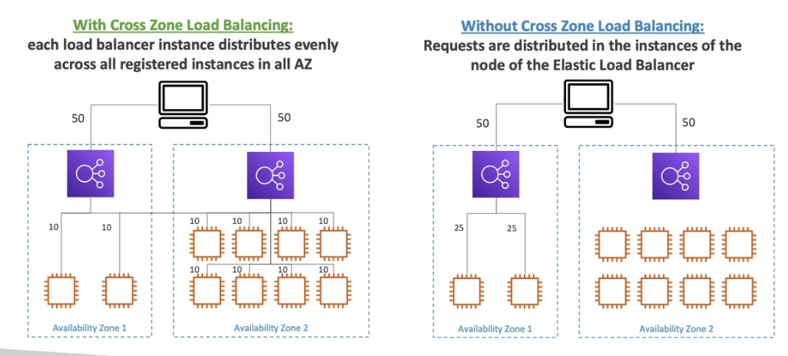
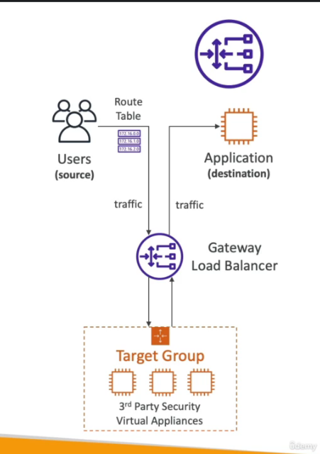

# Load Balancing in AWS
Load balancers are servers that will forward traffic to other servers downstream

Why use a load balancer?
- single point of access to application
- spread load across the downstream instances
- seamlessly handle failures of downstream instances
- do regular health checks to your instnaces
- provide HTTPS
- enforce stickiness with cookies
- high availability
- separate public traffic from private traffic

## ELB
Elastic Load Balancer is a managed load balancer
- AWS guarantees that it will be working
- AWS takes care of upgrades, maintenance, high availability
- integrated with many AWS offerings

It cost less to setup your own load balancer, but managing/maintaining it would be a lot of effort

Health Checks
- can let load balancer know if EC2 instance is working
- you can set up an endpoint where the load balancer will send a request to for health checks (typically /health)
  - 200 OK if anything else then instance would be marked as unhealthy

Sticky Sessions  
The idea is when a client makes a request multiple times, they will always hit the same instance behind the LB. Helps make sure that the user doesn't lose their session data
- Application-based Cookies (can be custom generated by the application or by the ALB)
  - when cookie is generated by ALB, it will be named **AWSALBAPP**
- Duration-based Cookies
  - generated by load balancer
  - duration
  - cookie name is **AWSALB**

Deregistration Delay  
Time to complete "in-flight requests" while the instance is de-registering or unhealthy. The LB will stop sending new requests to the EC2 instance that is being de-registered

Server Name Indication  
SNI solves the problem of loading multiple SSL certificates onto one web server (to server multiple websites)  
Only available for ALB and NLB, and CloudFront

Cross-Zone Load Balancing  
Each load balancer instance distributes evenly across all registered instances in all AZ. This is enabled by default for ALB  

### Application Load Balancer (ALB)
on Layer 7 (HTTP), great for microservices and container-based application
- for multiple HTTP application across machines or multiple application on the same machine
- support for HTTP/2 and WebSocket
- supports redirects
- has port mapping feature to redirect to a dynamic port
- ~ 400ms ALB
Extra notes:
- ALB has fixed hostnames
- application servers do not see IP, they have to look at the header "X-Forwarded-For"

Routing Tables
- based on path in URL
- based on hostname in URL
- based on Query String or Headers

Targets
- ec2 instances
- ecs tasks
- lambda function
- ip addresses (must be private IPs)

### Network Load Balancer (NLB)
on Layer 4 (TCP/UDP)
- can handle millions of request per seconds
- less ~100 ms latency
- one static IP per AZ (support Elastic IP)

Targets
- ec2 instance
- ip addresses (must be private IPs)
- Application Load Balancer

### Gateway Load Balancer (GWLB)
on Layer 3 (network layer, ip packets)
- used to deploy, scale, and manage a fleet of 3rd party network virtual appliances
    - such as firewalls, intrusion detection, deep packet inspection, etc
      
- combines the following functions:
  - transparent network gateway for single entry/exit for all traffic
  - load balancer for distributing traffic to your virtual appliances
- **uses the GENEVE protocol on port 6081**

Targets
- ec2 instances
- ip addresses (must be private IPs)

## Auto Scaling Groups (ASG)
Goal of ASG is to:
- scale out to match increased load (adding ec2 instances)
- scale in to match a decreased load (removing ec2 instances)
- can ensure a min/max number of EC2 instances running
- automatically register new instances to a load balancer

Health checks from a LB can be passed to the ASG. Can also scale based off of CloudWatch alarms

ASG Launch Template (very similar to EC2 instance creation):
- ami+instance type
- ec2 user data
- ebs volumes
- sg
- ssh key pair
- iam roles
- network/subnet
- LB information
- scaling policies
- min/max instances

Scaling Policies:
1. Target Tracking Scaling
   - simplest
   - ex) keep ASG CPU to stay around 40% usage
2. Simple/Step Scaling
   - ex) when CW alarm is trigged, then add 2 units
3. Scheduled Actions
   - ex) increase the min capacity to 10 from 5 on Fridays
4. Predictive scaling
   - continuously forecast load and schedule scaling ahead

Metrics to Scale on:
- CPUUtilization
- RequestCountPerTarget
- Average Network In/Out
- Custom metrics

Scaling Cooldowns  
After a scaling activity happens, you are in the cooldown period (default 300 seconds, can be changed). This allows for metrics to stabilize  
Tip: Use AMI to reduce configuration time to serve requests faster