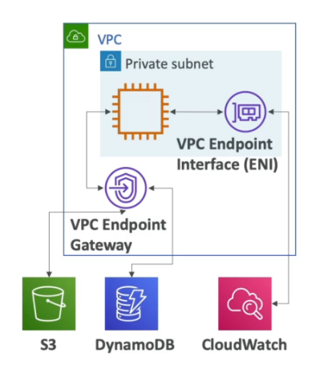

# VPC
For the AWS Certified Developer Exam, VPC isn't a very big topic. However, it is still good to know. What's listed here is what could appear in the exam.

## Subnets
Allows you to partition your network inside your VPC (defined at AZ level)

A "public" subnet is a subnet that is accessible from the internet.  
A "private" subnet is a subnet that is not accessible from the internet, usually restricts connection internally.

Route Tables  
defines access to internet or connections between subnets

## Internet Gateway
IGW helps our VPC instances connect with the internet

The public subnet will have a route to the IGW

## NAT Gateway
There are two types of this:
- NAT Gateways (AWS Managed)
- NAT Instances (self-managed)

A NAT Gateway/Instance gets deployed on the public subnet, then a route is created from the NAT to the private subnet and another route is created from the NAT to the IGW.

These allow your instances in your private subnets to access the internet while remaining private  
(Internet has to travel through NAT Gateway first before reaching the private subnet)

## Network ACL
A firewall which controls traffic from and to subnet (ALLOW OR DENY) and are attached at the Subnet level. (Only applied to IP addresses)

First mechanism of defense for the subnet. Internet would reach NACL first then the instances in the subnet.

## VPC Peering
Connect two VPC, privately using AWS network (make them behave as if they were in the same network)
- they must not have overlapping CIDR
- VPC peering is not transitive

## VPC Endpoints
Allows you to connect to AWS Services using a private network instead of the public network. Gives you enhanced security and lower latency to access AWS services

Endpoint Gatesways:
- S3
- DynamoDB

Endpoint Interface:
- rest of the AWS services

Notes to self:
- whenever you talk to AWS services, it always communicate through public internet
- if an instance is in a private subnet, that instance would have no way to talk to an AWS service UNLESS a VPC endpoint is set up for that service
- VPC endpoints will only work within the VPC

## Site to Site VPN and Direct Connect
Site to Site VPN allows an on-premise VPN to AWS. This connection is encrypted but it does go over the public internet. Quick and easy to set up.

Direct Connect (DX) is a physical connection between on-premises and AWS. The connection remains private. This is probably the preferred option for most big accounts, HOWEVER it does take a while to establish (at a month).

Note: Both of these options cannot access VPC endpoints